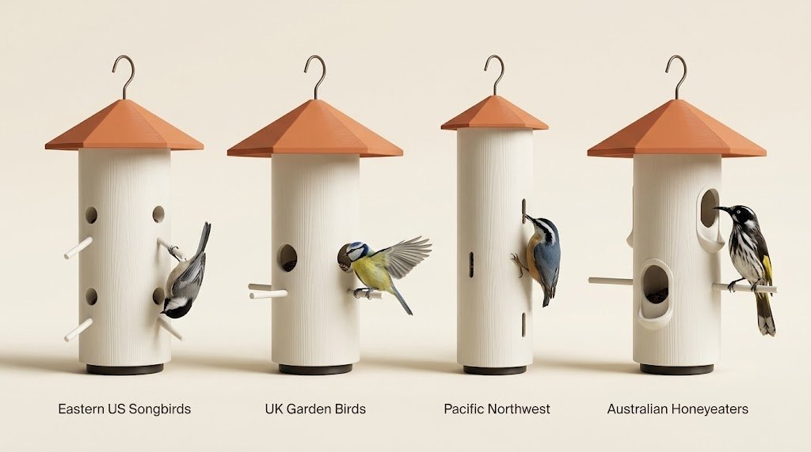

# Perchwise



**Parametric bird feeder. Tune by species and region.**

A KCL parametric model for 3D-printed bird feeders, with geometric selectivity tuned to admit specific bird species while excluding unwanted visitors. Fork the file, set a region preset, print.

## Why geometry, not weight

Most "selective" feeders work by weight — a sparrow lands, a counterweight closes the port. Perchwise takes a different approach: six geometric parameters, each mapped to bird anatomy and behaviour, that gate access without any moving parts. The same physical feeder admits a chickadee but excludes a starling because the _port diameter_ won't fit the starling's head, the _perch angle_ discourages its perching posture, and the _roof overhang_ obstructs its approach trajectory.

Geometric selectivity is statistical, not absolute — but it's quiet, mechanical, and printable.

## Region presets

| Region         | Targets                                     | Excludes                      | Signature move                     |
| -------------- | ------------------------------------------- | ----------------------------- | ---------------------------------- |
| **Eastern US** | Chickadees, titmice, nuthatches, finches    | Grackles, starlings, sparrows | Downward-angled perches            |
| **UK**         | Tits, robins, goldfinches, chaffinches      | Starlings, magpies, pigeons   | Level perches, larger overhang     |
| **Pacific NW** | Chestnut-backed chickadee, nuthatch, siskin | Sparrows, starlings           | No perches — clinging access only  |
| **Australia**  | Honeyeaters, silvereyes                     | Mynas, sparrows               | Wider ports for long slender beaks |

Full data tables, exclusion thresholds, and design reasoning live in the [interactive species guide](https://atlantice.github.io/perchwise/) and in [SPECIES_GUIDE.md](SPECIES_GUIDE.md).

## Repository layout

```
.
├── main.kcl           — assembly: imports parts and the active config
├── config.kcl         — region presets and the six tunable parameters
├── tube.kcl           — cylindrical body with parametric ports and perches
├── roof.kcl           — removable conical roof with overhang and hanger
├── cleanoutPlug.kcl   — friction-fit base plug for cleaning and drainage
├── project.toml       — Zoo project descriptor
├── thumbnail.png      — preview render
├── index.html         — interactive species guide (deployed via GitHub Pages)
├── SPECIES_GUIDE.md   — selectivity methodology and tuning reference
└── CONTRIBUTING.md    — how to propose a new region preset
```

## Getting started

1. **Open the model.** Open `main.kcl` in [Zoo Design Studio](https://zoo.dev) (or any KCL-aware tool). It imports geometry from `tube.kcl`, `roof.kcl`, and `cleanoutPlug.kcl`, with parameters resolved from `config.kcl`.

2. **Pick a region preset.** Open `config.kcl` and change one line:

   ```kcl
   export regionPreset = easternUsSongbirds
   ```

   The four shipped presets are `easternUsSongbirds`, `ukGardenBirds`, `pacificNorthwest`, and `australianHoneyeaters`. There's also a `customPreset` block at the bottom of the presets section — set `regionPreset = customPreset` and edit those values directly to dial in your own targets.

3. **Six parameters, every preset.** Each preset is just six numbers:

   | Parameter            | What it gates                                                    |
   | -------------------- | ---------------------------------------------------------------- |
   | `portDiameter`       | Head and body width — the primary admit/exclude lever            |
   | `perchLength`        | Body length and tail clearance — `0mm` disables perches entirely |
   | `perchAngleDeg`      | Perching posture — negative angles favour acrobatic feeders      |
   | `numPorts`           | Capacity and approach geometry                                   |
   | `roofOverhang`       | Weather protection and approach trajectory                       |
   | `portHeightFromBase` | Vertical placement — raised ports favour clinging birds          |

4. **Generate and export.** Render the assembly, then export each part to STL: tube body, roof, and cleanout plug. The three parts are kept as separate top-level bodies on purpose — don't union them.

5. **Print.** PETG or ASA recommended for outdoor use. Tube and roof print without supports if oriented vertically.

6. **Observe.** Watch what visits for two weeks. Tune values based on what you actually see, not what the table predicts.

## What else is tunable

The six parameters above are the _species-selectivity_ knobs. `config.kcl` exposes a much wider surface area if you want to change physical properties of the feeder:

- **Capacity** — `tubeHeight`, `tubeDiameter` for seed reservoir size
- **Print durability** — `wallThickness` for FDM strength
- **Roof character** — `roofHeight`, `roofSides` (for the facet count), `roofLipRadialClearance` for friction-fit
- **Drainage and cleanout** — `numDrainageHoles`, `drainageHoleDiameter`, `cleanoutOpeningDiameter`, plug fit clearances
- **Hanger** — `hookDiameter`, `hookHeight`
- **Appearance** — `bodyColor`, `roofColor`, `perchColor`, `hookColor`, `cleanoutColor` for renders

Most of these you'll never need to touch. They're exposed because `config.kcl` is the single source of truth for everything geometric in the model — there are no magic numbers buried in `tube.kcl` or `roof.kcl`.

## Documentation

- **[Interactive species guide](https://atlantice.github.io/perchwise/)** — preset values, rotatable wireframe model, species tables, exclusion methodology
- **[SPECIES_GUIDE.md](SPECIES_GUIDE.md)** — full methodology in markdown form
- **[CONTRIBUTING.md](CONTRIBUTING.md)** — how to propose a new region preset

## Design notes

- These are **starting points**, not final calibrations. Geometric selectivity is statistical.
- **Juveniles are smaller than adults of the same species.** A port rated for adult sparrows may admit juvenile sparrows. This is a property of geometry, not a flaw in the design.
- **Tune based on observation.** If unwanted species visit, tighten the exclusion parameters. If targets struggle to access, widen the ports or adjust perch geometry.
- The **tube height and overall diameter** are also exposed in `config.kcl` if you want different seed capacity or proportions.

## Contributing

Found a region that works in your area? See [CONTRIBUTING.md](CONTRIBUTING.md) for how to propose a new preset. The short version: open an issue with target species, exclusion species, six parameter values, and source citations for body measurements.

For bugs, geometry suggestions, or anything else, [open an issue](https://github.com/atlantice/perchwise/issues).

## License

This project is licensed under the [Creative Commons Attribution-ShareAlike 4.0 International License](https://creativecommons.org/licenses/by-sa/4.0/) — free to use, modify, and distribute, provided you give credit and share improvements under the same license.

## Credits

Designed by Magus Pereira. Built with [Zoo Design Studio](https://zoo.dev) and KCL. Species data drawn from the [Cornell Lab of Ornithology](https://www.allaboutbirds.org/), [British Trust for Ornithology](https://www.bto.org/learn/about-birds/birdfacts), [Birdlife Australia](https://birdlife.org.au/), and [Project FeederWatch](https://feederwatch.org/), with reference to HANZAB and the Sibley Guide to Birds.

---

Submitted to the [Zoo Makeathon](https://zoo.dev). Questions, observations, or weird bird stories — [open an issue](https://github.com/atlantice/perchwise/issues).
